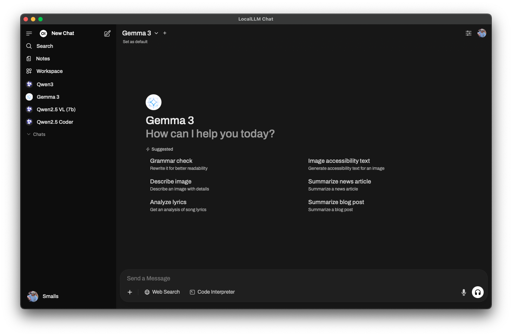

#  LocalLLM Chat

A stupid way to run Open WebUI locally without having to manage the container resources manually.

> [!CAUTION]
> This is primarily for my own personal usage. Your mileage may vary with building/using this. **All development and testing has been done on macOS.**

> [!WARNING]
> Also this was sorta/kinda thrown together quickly, so, fair warning, you'll see some janky code. 😬

## 🤝 License

The source code for this project is licensed with the [MIT License](LICENSE).
